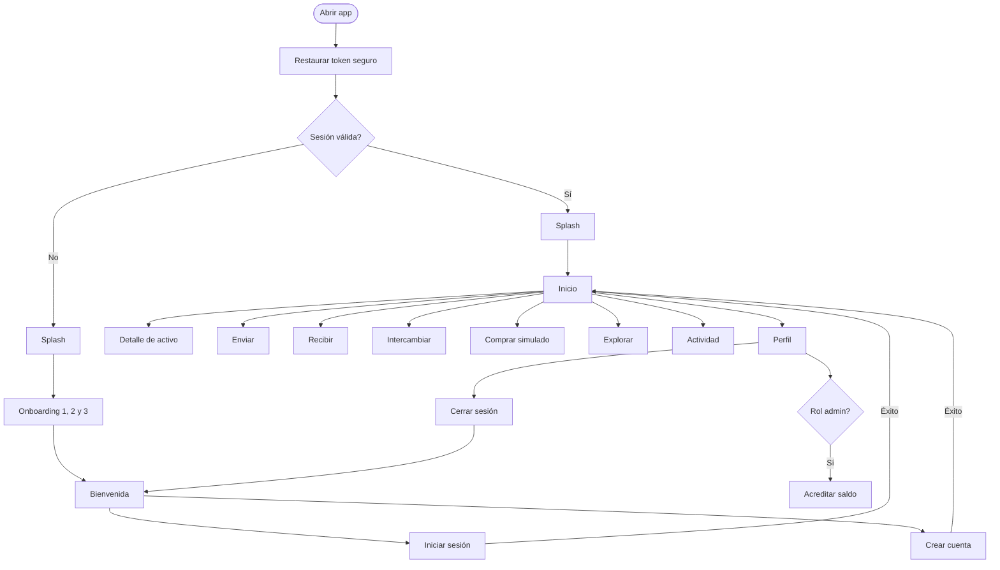
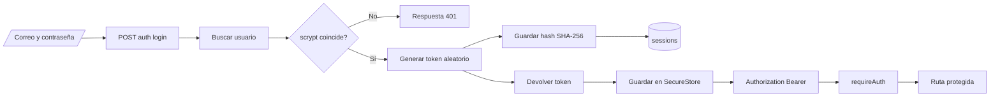
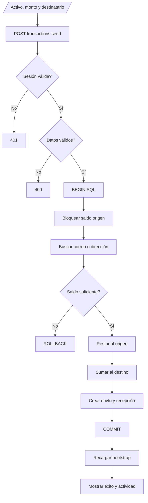
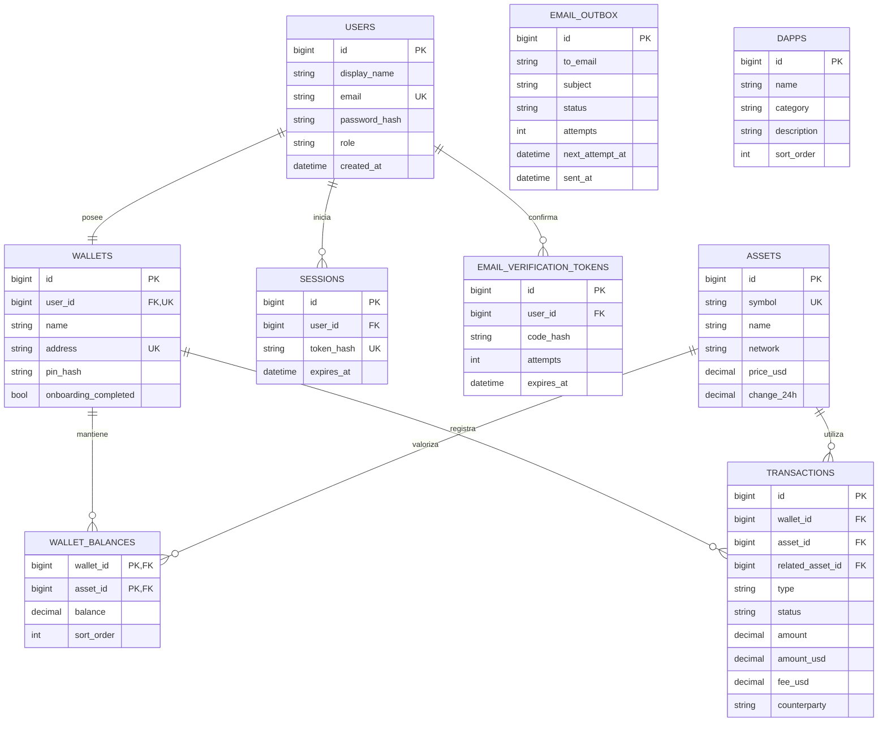

# Guía técnica de Wallet

## 1. Qué es el proyecto

Wallet es una aplicación móvil construida con React Native y Expo. Simula una billetera de criptomonedas, pero todos los usuarios, saldos y movimientos pertenecen al sistema interno: no se conecta a un banco, blockchain, exchange ni proveedor de pagos.

La solución tiene tres capas principales:

1. La app Android/iOS muestra las pantallas, conserva la sesión y envía solicitudes HTTP.
2. La API Express valida datos, autentica usuarios y aplica las reglas de negocio.
3. MySQL/MariaDB conserva usuarios, billeteras, activos, saldos, sesiones y transacciones.

## 2. Arquitectura general

```mermaid
flowchart LR
    subgraph client ["Aplicación cliente"]
        mobile["React Native y Expo"]
    end

    subgraph gateway ["Entrada de producción"]
        nginx["Nginx y HTTPS"]
    end

    subgraph service ["Backend"]
        express["API Express"]
        auth["Autenticación y sesiones"]
        repository["Reglas y repositorio"]
    end

    subgraph datastore ["Persistencia"]
        mysql["MySQL o MariaDB"]
    end

    mobile -->|"HTTPS JSON"| nginx
    nginx -->|"Proxy puerto 4100"| express
    express -->|"Valida bearer"| auth
    auth -->|"Autoriza operación"| repository
    repository -->|"Consultas y transacciones"| mysql
```



En desarrollo, la app se conecta directamente a `http://10.0.2.2:4100` desde el emulador Android. En producción usa `https://wallet-rest.armandovelasquez.com`, Nginx recibe HTTPS y reenvía la petición a Express en el puerto privado `3100` por defecto, o al valor configurado en `PORT`.

## 3. Directorios principales

```text
Wallet/
├── .github/
│   └── workflows/
│       └── backend.yml             Deploy automático de la API
├── api/
│   ├── scripts/
│   │   ├── init-db.js              Base local y datos de demostración
│   │   └── init-production-db.js   Tablas y admin de producción
│   ├── src/
│   │   ├── server.js               Arranque y conexión inicial
│   │   ├── app.js                  Middleware y rutas REST
│   │   ├── auth.js                 Hashes, tokens y sesiones
│   │   ├── repository.js           Consultas y reglas de negocio
│   │   ├── db.js                   Pool y transacciones SQL
│   │   └── config.js               Variables de entorno
│   ├── .env.example
│   └── package.json
├── database/
│   ├── schema.sql                  Estructura relacional
│   ├── seed.sql                    Cuenta y datos para desarrollo
│   └── production-seed.sql         Catálogos sin cuenta demo
├── mobile/
│   ├── android/                    Proyecto nativo generado
│   ├── src/
│   │   ├── App.tsx                 Estado global y navegación
│   │   ├── screens.tsx             Pantallas y formularios
│   │   ├── components.tsx          Botones, cards, header y tabs
│   │   ├── api.ts                  Cliente HTTP y token seguro
│   │   ├── types.ts                Contratos TypeScript
│   │   ├── theme.ts                Colores, radios y sombras
│   │   └── demoData.ts             Datos antiguos de referencia
│   ├── app.json                    Configuración Expo
│   ├── index.js                    Entrada de React Native
│   └── package.json
├── artifacts/
│   └── Wallet-demo-android.apk     APK de prueba
├── docs/                            Documentación y capturas
├── package.json                    Workspaces y comandos raíz
└── package-lock.json               Versiones bloqueadas
```

## 4. Librerías importantes

### Aplicación móvil

- `react` y `react-native`: componentes, estado y aplicación nativa.
- `expo`: herramientas de ejecución y compilación.
- `expo-secure-store`: guarda el token de sesión cifrado por el sistema operativo.
- `expo-linear-gradient`: fondos y botones degradados del diseño.
- `expo-status-bar` y `expo-system-ui`: apariencia del sistema Android/iOS.
- `react-native-safe-area-context`: evita que el contenido choque con notch y barras.
- `@expo/vector-icons`: iconos Ionicons.
- `Animated`, incluido en React Native: escalas, entradas y efectos; no se agregó una librería externa de animación.

### API

- `express`: servidor y rutas REST.
- `mysql2/promise`: pool de conexiones, consultas parametrizadas y transacciones.
- `helmet`: cabeceras HTTP de seguridad.
- `cors`: acceso desde clientes permitidos; actualmente usa la configuración abierta predeterminada.
- `dotenv`: carga `api/.env`.
- `node:crypto`: genera tokens y direcciones simuladas, y protege contraseñas/PIN con `scrypt`.
- `nodemailer`: entrega confirmaciones y avisos mediante SMTP con clave de aplicación.

## 5. Navegación de la app

La navegación es una máquina de estados pequeña implementada en `App.tsx`. El tipo `AppScreen` enumera las pantallas y `setScreen()` selecciona cuál se renderiza. Esto evita una dependencia adicional, aunque para navegación nativa más compleja se podría migrar a React Navigation.



Las pantallas `create`, `recovery` y `pin` conservan parte del recorrido visual inicial. El registro operativo actual entra por `register` y crea la billetera desde la API; la frase mostrada en `recovery` no es una clave blockchain real.

## 6. Flujo de autenticación



El token sin transformar solo vive en el dispositivo. MySQL conserva su hash, no el token original. La sesión vence después de 30 días y cerrar sesión elimina la fila correspondiente.

## 7. Flujo de una transferencia interna



El uso de `SELECT ... FOR UPDATE`, `BEGIN`, `COMMIT` y `ROLLBACK` evita saldos parciales si dos operaciones intentan modificar una cuenta al mismo tiempo o si una consulta falla.

## 8. Modelo de base de datos



`wallet_balances` es la tabla puente entre billeteras y activos. Su clave primaria compuesta impide que una billetera tenga dos saldos separados para el mismo activo. `related_asset_id` solo se utiliza cuando una transacción relaciona dos activos, como un swap. `dapps` es un catálogo independiente y por ahora solo alimenta la pantalla Explorar.

## 9. Flujo de datos en la interfaz

Después del login o al restaurar una sesión, `App.tsx` solicita `GET /api/v1/bootstrap`. La API devuelve en una sola respuesta:

- usuario y rol;
- datos de la billetera;
- activos con saldo y valor en USD;
- últimas 30 transacciones;
- catálogo de dApps.

Ese objeto `Bootstrap` se guarda en estado React y se entrega a las pantallas como propiedades. Después de enviar, comprar, intercambiar o acreditar, la app repite `bootstrap` para mostrar el estado confirmado por MySQL y no un cálculo optimista del teléfono.

## 10. Rutas principales de la API

| Método | Ruta | Función |
|---|---|---|
| `GET` | `/health` | Comprueba que el proceso está activo |
| `POST` | `/api/v1/auth/register` | Crea usuario, billetera y balances en cero |
| `POST` | `/api/v1/auth/login` | Verifica credenciales y crea sesión |
| `POST` | `/api/v1/auth/verify-email` | Confirma el correo con un código de 6 dígitos |
| `POST` | `/api/v1/auth/resend-verification` | Genera y envía un código nuevo |
| `GET` | `/api/v1/auth/me` | Valida/restaura la sesión |
| `POST` | `/api/v1/auth/logout` | Revoca la sesión |
| `GET` | `/api/v1/bootstrap` | Carga toda la vista principal |
| `POST` | `/api/v1/transactions/send` | Transfiere entre dos cuentas Wallet |
| `POST` | `/api/v1/transactions/buy` | Simula una compra y acredita saldo |
| `POST` | `/api/v1/swap` | Convierte saldo entre activos internos |
| `GET` | `/api/v1/admin/users` | Lista cuentas para administración |
| `POST` | `/api/v1/admin/fund` | Acredita saldo como administrador |

## 11. Qué es real y qué es simulado

Es real dentro del proyecto:

- registro y login persistentes;
- contraseñas y PIN hasheados;
- sesiones persistentes;
- saldos almacenados en MySQL;
- transferencias atómicas entre usuarios;
- historial, compras, swaps y acreditaciones administrativas;
- despliegue con GitHub Actions, systemd, Nginx y HTTPS.

Es simulado o solamente visual:

- precios de criptomonedas;
- compra con tarjeta;
- redes blockchain y direcciones externas;
- frase de recuperación;
- QR de recepción;
- conexión con dApps;
- integración bancaria, KYC y movimientos de dinero real.

Por eso el sistema sirve como demo funcional interna, pero no debe operar fondos reales sin agregar custodia, auditoría, idempotencia, límites, recuperación de cuenta, verificación de correo, rate limiting y controles regulatorios.
